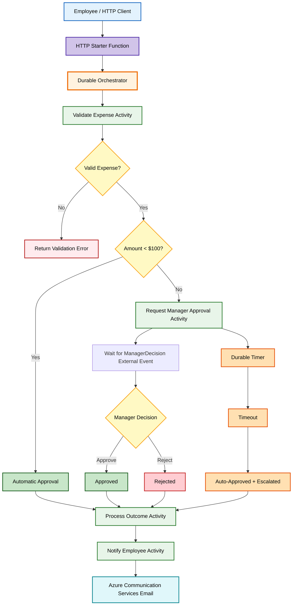
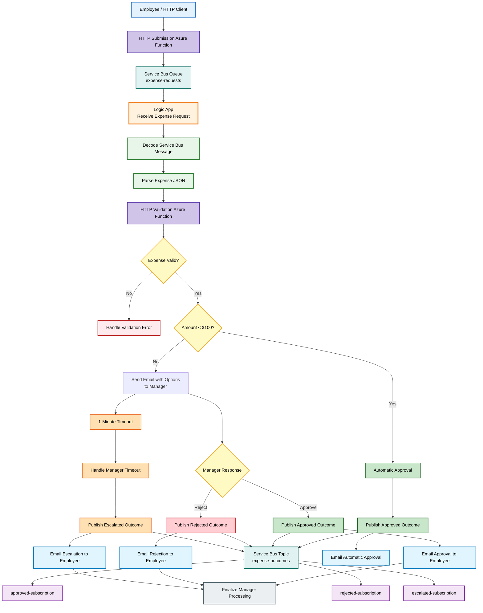

# CST8917 Assignment 2 - Dual Implementation of an Expense Approval Workflow

**Student:** Khalid Amchat  
**Student Number:** `041125350`  
**Course:** CST8917 - Serverless Applications  
**Term:** S26  

---

## 1. Project Overview

This project implements the same expense approval workflow using two Azure serverless orchestration approaches:

- **Version A:** Azure Durable Functions using Python v2.
- **Version B:** Azure Logic Apps with Azure Service Bus.

The purpose is to compare a **code-first orchestration approach** with a **visual/declarative orchestration approach** based on direct implementation experience.

### Business Rules

| Rule | Implementation |
|---|---|
| Input | Employee name, employee email, amount, category, description, and manager email |
| Validation | All required fields must exist and category must be valid |
| Valid categories | `travel`, `meals`, `supplies`, `equipment`, `software`, `other` |
| Expense under $100 | Automatically approved |
| Expense $100 or more | Requires manager approval |
| Manager timeout | Automatically approved and flagged as `escalated` |
| Notification | Employee receives an email with the final outcome |

---

## 2. Architecture

### Version A — Durable Functions



### Version B — Logic Apps + Service Bus



---

## 3. Version A: Azure Durable Functions

### 3.1 Summary

Version A uses Azure Durable Functions with the Python v2 programming model. The workflow is coordinated by an orchestrator and broken into activity functions for validation, manager-request processing, final outcome processing, and employee notification.

The main components are:

- HTTP client/starter function for new expense requests.
- Durable orchestrator.
- Validation activity.
- Manager approval request activity.
- HTTP manager-decision endpoint.
- External `ManagerDecision` event.
- Durable timer for the approval timeout.
- Outcome-processing activity.
- Employee-notification activity.

### 3.2 Key Design Decisions

I used the Durable Functions **Human Interaction pattern** for expenses of $100 or more. The orchestrator creates two tasks:

1. Wait for the external `ManagerDecision` event.
2. Wait for a durable timeout timer.

The orchestrator uses `task_any()` to continue when either event occurs first. If the manager approves or rejects, the timer is cancelled. If the timer completes first, the expense is automatically approved and marked as escalated.

External work such as email delivery is performed inside activity functions instead of the orchestrator. This keeps the orchestrator deterministic and compatible with Durable Functions replay behavior.

For the assignment demonstration, the timeout was configured to a short period. A production system would normally use a much longer manager approval period.

---

## 4. Version B: Azure Logic Apps + Service Bus

### 4.1 Summary

Version B uses an Azure Service Bus queue to receive expense requests and an Azure Logic App to orchestrate the business workflow. The Logic App calls an Azure Function through HTTP to validate the request.

The implementation includes:

- `expense-requests` Service Bus queue.
- Logic App Consumption workflow.
- Python HTTP validation Function.
- Office 365 Outlook manager approval.
- Service Bus `expense-outcomes` topic with 3 subscriptions using SQL filters for the `outcome`: 
        - `approved-subscription`.
        - `rejected-subscription`.
        - `escalated-subscription`.
- Employee email notifications.

### 4.2 Manager Approval Approach

For expenses of $100 or more, I used the Office 365 Outlook **Send email with options** action. The manager receives an email with:

- `Approve`
- `Reject`

The action waits for a response. A short timeout is configured for demonstration.

Two alternative paths are connected directly to the manager action:

- **Successful manager response:** evaluate Approve or Reject.
- **Timed-out manager action:** automatically approve and publish an `escalated` outcome.

A final merge action completes the workflow after either the manager-response path or timeout path finishes.

### 4.3 Service Bus Filtering

The Logic App publishes final outcomes to the `expense-outcomes` topic.

The three subscriptions use SQL filters:

```sql
outcome = 'approved'
```

```sql
outcome = 'rejected'
```

```sql
outcome = 'escalated'
```

This ensures each subscription receives only the appropriate outcome.

### 4.4 Challenges

Several configuration issues required troubleshooting:

- The HTTP validation Function initially received incorrectly serialized JSON from the Logic App.
- The native Azure Functions Logic App action could not be used with my Function's custom route, so I used the HTTP action instead.
- Service Bus subscription filters initially received no messages because the `outcome` value had to be sent as a real application property.
- The timeout initially triggered both the escalated and rejected paths.
- After fixing the branching, the workflow still appeared as Failed because the manager action had timed out even though escalation succeeded.
- I solved this by separating the success and timeout paths and adding a final merge action with appropriate **Run after** rules.

These issues showed that Logic Apps reduces the amount of code required, but complex branching still requires careful configuration.

---

## 5. Testing

Both implementations were tested with the six scenarios required by the assignment.

| # | Scenario | Expected Outcome | Version A | Version B |
|---:|---|---|:---:|:---:|
| 1 | Valid expense under $100 | Auto-approved | ✅ | ✅ |
| 2 | Expense ≥ $100, manager approves | Approved | ✅ | ✅ |
| 3 | Expense ≥ $100, manager rejects | Rejected | ✅ | ✅ |
| 4 | Expense ≥ $100, no manager response | Auto-approved + escalated | ✅ | ✅ |
| 5 | Missing required fields | Validation error | ✅ | ✅ |
| 6 | Invalid category | Validation error | ✅ | ✅ |

---

## 6. Comparison Analysis

### 6.1 Development Experience

Both implementations achieved the same business workflow, but the development experience was very different. Durable Functions felt more natural to me as a programmer because the complete workflow was expressed in Python. I could read the orchestrator from top to bottom and see the order of validation, automatic approval, manager approval, timeout, result processing, and notification. The activity functions also kept responsibilities separate. However, the code-first approach required more understanding of Durable Functions concepts such as orchestration replay, deterministic code, external events, durable timers, and activity chaining.

Logic Apps was faster for building visible branches because conditions and actions could be added through the designer. It was easy to understand the overall flow by looking at the diagram. However, configuration problems sometimes took longer to diagnose than Python errors. I had to troubleshoot JSON serialization when calling the validation Function, Service Bus application properties, the manager timeout, parallel branches, and run-after settings. Therefore, Logic Apps reduced coding but did not remove technical complexity.

### 6.2 Testability

Durable Functions was easier to test locally. I used Azurite, Azure Functions Core Tools, and `test-durable.http` to start orchestration instances, submit manager decisions, and check orchestration status. Most of the workflow could be developed before deploying to Azure. A code-first implementation would also be easier to extend with `pytest` unit tests for validation and processing logic.

Logic Apps depended more heavily on deployed Azure resources. The queue, topic, subscriptions, Outlook connector, and Logic App were tested in Azure. The run history was very useful, but each test required submitting a message and waiting for the Service Bus trigger. This made iteration slower than local Durable Functions testing. Automated testing is possible for Logic Apps, but for this assignment the practical approach was integration testing through the deployed workflow and inspecting each run.

### 6.3 Error Handling

Durable Functions gave me more explicit control over workflow behavior. The orchestrator could wait for a manager decision and a durable timer at the same time, then continue based on whichever task completed first. Activities could fail independently, and retry policies could be added in code. This approach made error-handling rules precise and version-controlled.

Logic Apps provided visual error handling through action status and **Configure run after**. This became especially important for the timeout scenario. At first, the escalation email was sent correctly, but the workflow was still marked Failed because the manager approval action had timed out. I also initially received both an escalated and rejected result because the Reject condition executed after the timeout path. I corrected this by creating separate success and timeout branches and adding a final merge action that accepted successful or skipped branch outcomes. This experience showed that Logic Apps can handle failures well, but the run-after dependencies must be designed carefully.

### 6.4 Human Interaction Pattern

Durable Functions provided the more natural technical implementation of the human interaction requirement. I used an external event for `ManagerDecision` and a durable timer for the deadline. The orchestrator waited without continuously executing while the manager made a decision. An HTTP endpoint simulated the manager response and raised the external event to the correct orchestration instance.

Logic Apps required a different design. I used the Office 365 Outlook **Send email with options** action with Approve and Reject choices. The action waited for the manager's response and used a one-minute timeout for demonstration. A parallel timeout branch handled the no-response case and automatically approved the expense while flagging it as escalated. The Logic Apps approach was visually easy to demonstrate, but the Durable Functions pattern provided more direct control and would be easier to customize for more complex approval rules.

### 6.5 Observability

Logic Apps was the strongest solution for visual observability. The run history showed every action, condition result, skipped branch, duration, input, and output. During troubleshooting, I could immediately see whether validation succeeded, whether the amount condition selected True or False, and whether the manager action succeeded or timed out. The designer also made the workflow easier to explain during a demonstration.

Durable Functions provided status endpoints, custom orchestration status, Function logs, and Application Insights, but understanding a complete business run required checking several function executions and the orchestration status. This gives developers detailed technical information, but it is less intuitive for a non-developer than the Logic App run diagram.

### 6.6 Cost

I used Azure public pricing as a rough estimate. My assumptions are 30 days per month, **100 expenses/day = 3,000 expenses/month**, and **10,000 expenses/day = 300,000 expenses/month**.

For Durable Functions, I assume **Flex Consumption on-demand**, a 2-GB instance, approximately five function executions per expense, and about one second of total active function execution per expense. Waiting for manager input is durable waiting rather than one minute of continuously running compute. Azure currently includes **250,000 on-demand executions and 100,000 GB-s per month** for Flex Consumption. Current public pricing lists additional on-demand executions at about **$0.40 per million** and resource consumption at about **$0.000026/GB-s**.

For Logic Apps Consumption, I assume about five built-in workflow operations and an average of 3.5 standard connector calls per expense. Azure lists the first **4,000 built-in action executions** as included, then approximately **$0.000025 per action**, while standard connector calls are approximately **$0.000125 each**. Service Bus Standard is required because the project uses topics and subscriptions. I assumed roughly **$9.72/month** for the Standard base charge, with the first 13 million messaging operations included.

| Volume | Durable Functions estimate | Logic Apps + Service Bus estimate |
|---|---:|---:|
| ~100 expenses/day | Approximately **$0 Functions compute** under the monthly Flex free grant, plus small storage/email costs | Approximately **$11-$12/month**, mainly Service Bus Standard and Logic Apps connector calls |
| ~10,000 expenses/day | Approximately **$13-$15/month** for Functions compute under these assumptions, plus storage/email | Approximately **$175-$185/month** for Logic Apps actions/connectors and Service Bus Standard |

These estimates can change significantly with execution duration, memory, connector usage, region, retries, email volume, and subscription discounts. At low volume, Durable Functions is especially cost-effective because of the consumption free grant. At high volume, the Logic Apps per-action and connector-call model becomes more noticeable, while its value may still justify the cost when visual workflow management and managed connectors are priorities.

---

## 7. Recommendation

If I were building this workflow for production, I would choose **Azure Durable Functions** when the development team is comfortable with Python and expects the approval process to become more complex. In this assignment, Durable Functions gave me clearer programmatic control over the human interaction pattern. The external event and durable timer directly represented “wait for manager decision or timeout,” and most of the workflow could be tested locally. The code can also be reviewed, versioned, and unit-tested using the same practices as the rest of an application. At larger volumes, the consumption-based cost can also be attractive.

I would choose **Logic Apps** instead when the workflow needs frequent integration with Microsoft 365 or other SaaS services, or when operations staff and non-developers need to understand the workflow visually. Its run history made troubleshooting and demonstrations much easier because every branch, input, output, and skipped action was visible. The Outlook and Service Bus connectors also reduced the amount of integration code I had to write.

My main concern with Logic Apps is that visual workflows can still become complicated. For this specific workflow, my production preference is therefore Durable Functions for the core orchestration, with Logic Apps being a strong option for integration-heavy workflows where visual management is more important than code-level control.

---

## 11. Presentation and Demo

**Presentation:** [`presentation/slides.pptx`](presentation/slides.pptx)

**Video:** 

YouTube demo video link:
[`Watch demo video`](https://youtu.be/J6HL-HDoJuo) 

---

## 12. References

- Microsoft. [Azure Durable Functions overview](https://learn.microsoft.com/azure/azure-functions/durable/durable-functions-overview)
- Microsoft. [Durable Functions external events](https://learn.microsoft.com/azure/azure-functions/durable/durable-functions-external-events)
- Microsoft. [Durable Functions code constraints](https://learn.microsoft.com/azure/azure-functions/durable/durable-functions-code-constraints)
- Microsoft. [Azure Logic Apps documentation](https://learn.microsoft.com/azure/logic-apps/)
- Microsoft. [Azure Logic Apps pricing](https://azure.microsoft.com/pricing/details/logic-apps/)
- Microsoft. [Azure Functions pricing](https://azure.microsoft.com/pricing/details/functions/)
- Microsoft. [Azure Service Bus pricing](https://azure.microsoft.com/pricing/details/service-bus/)
- Microsoft. [Azure Service Bus topic filters](https://learn.microsoft.com/azure/service-bus-messaging/topic-filters)
- Microsoft. [Azure Service Bus connector for Logic Apps](https://learn.microsoft.com/connectors/servicebus/)
- Microsoft. [Office 365 Outlook connector](https://learn.microsoft.com/connectors/office365connector/)
- Microsoft. [Azure Communication Services pricing](https://azure.microsoft.com/pricing/details/communication-services/)
- Microsoft. [Azure Pricing Calculator](https://azure.microsoft.com/pricing/calculator/)
- CST8917 Assignment 2 specification. [GitHub — 26S_CST8917 Assignment 2](https://github.com/modamin/26S_CST8917/tree/main/Assignment_2)

---

## 13. AI Disclosure

AI tools, including ChatGPT, were used during this assignment to help troubleshoot implementation errors, and assist with drafting and organizing documentation. All workflow configurations and code were reviewed, implemented, tested, and validated against the assignment requirements before inclusion in the final project.
